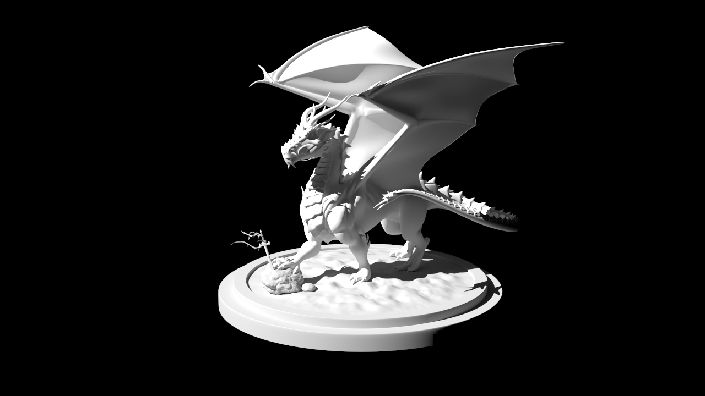
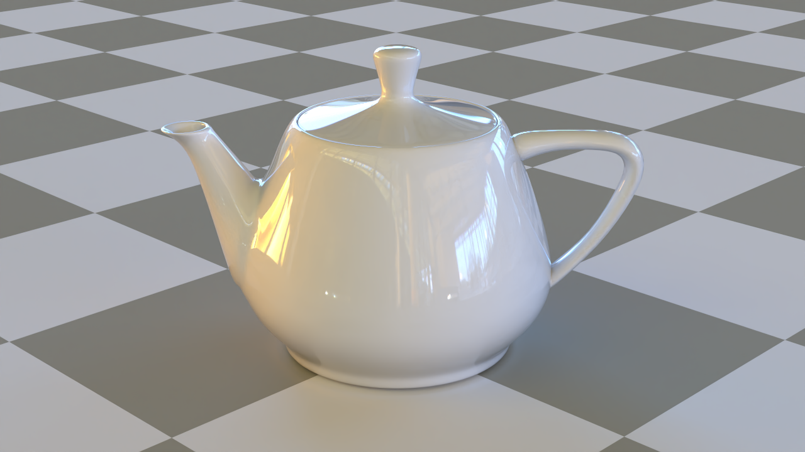
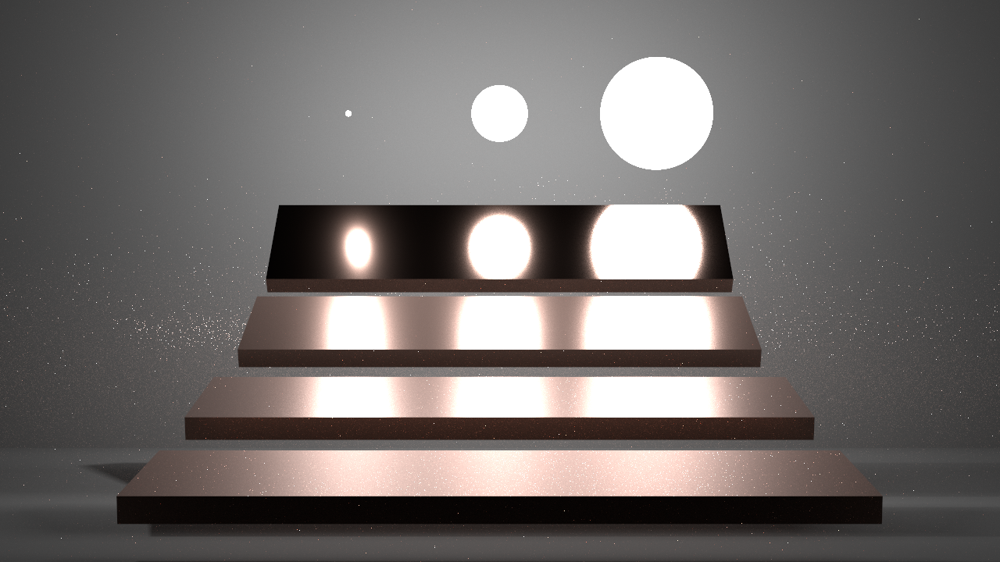
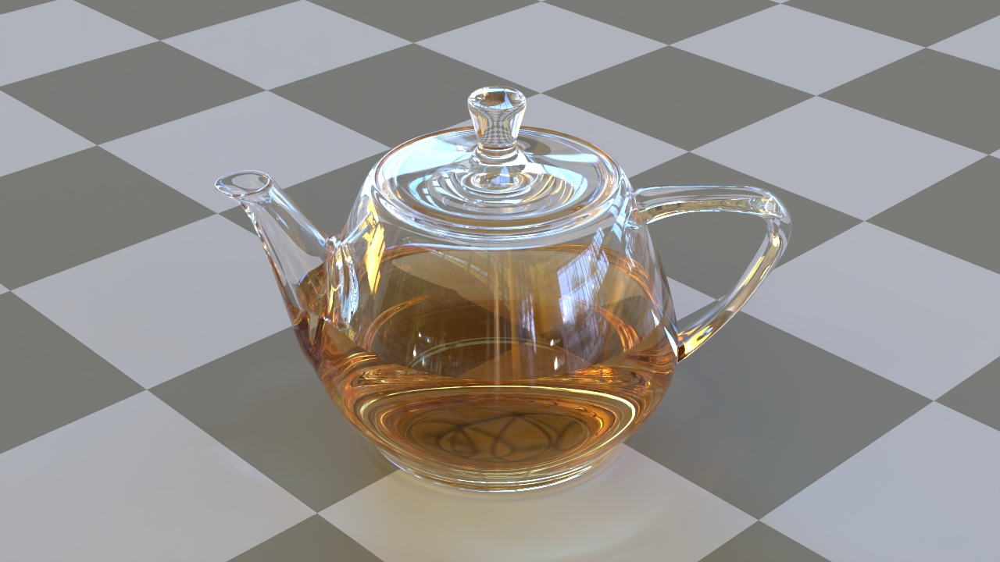

# Rene

WIP Vulkan Raytracing renderer entirely written in Rust.

Currently Rene supports [pbrt file format](https://www.pbrt.org/fileformat-v3) for scene description.

# Requirements

- Vulkan Raytracing ready GPU and Driver
- [LunarG Vulkan SDK](https://www.lunarg.com/vulkan-sdk/)
# Run

```
cargo run -- sample_scenes/current.pbrt
```

`out.png` will be produced.

## Denoiser

Rene has built-in OptiX or Oidn Denoiser if you enable "optix-denoiser" or "oidn-denoiser" feature.

You can denoise images using Optix Denoiser by "--denoiser=optix" flag.

You can denoise images using Oidn Denoiser by "--denoiser=oidn" flag.

# Examples

## Cornell box

```
cargo run -- .\sample_scenes\cornell-box\scene.pbrt
```


## Dragon

```
cargo run -- .\sample_scenes\dragon\scene.pbrt
```



## Teapot

```
cargo run --features=oidn-denoiser  -- --denoiser=oidn   .\sample_scenes\teapot\scene.pbrt
```



# Veach, MIS

```
cargo run  -- .\sample_scenes\veach-mis\scene.pbrt
```



## Teapot-full

Scene file cam be downloaded from https://benedikt-bitterli.me/resources/

With Oidn Denoiser
