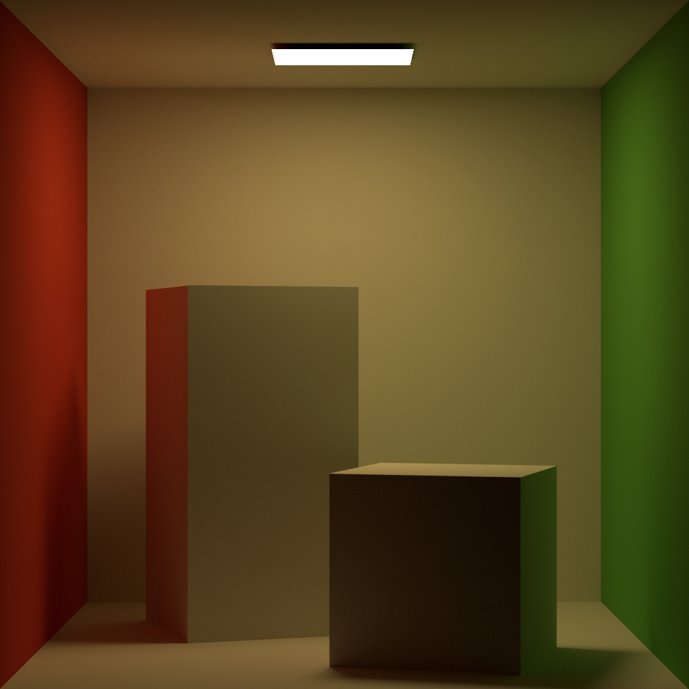

# Rene

WIP Vulkan Raytracing renderer entirely written by Rust.

# Requirements

- Vulkan Raytracing ready GPU and Driver
- [LunarG Vulkan SDK](https://www.lunarg.com/vulkan-sdk/)
# Run

```
cargo run -- sample_scenes/current.pbrt
```

`out.png` will be produced.

## Denoiser

Rene has built-in OptiX or Oidn Denoiser if you enable "optix-denoiser" or "oidn-denoiser" feature.

You can denoise images using Optix Denoiser by "--denoiser=optix" flag.

You can denoise images using Oidn Denoiser by "--denoiser=oidn" flag.

# Examples

## Cornell box

With Optix Denoiser

```
cargo run --features=optix-denoiser  -- --denoiser=optix .\sample_scenes\cornell-box\scene.pbrt
```

